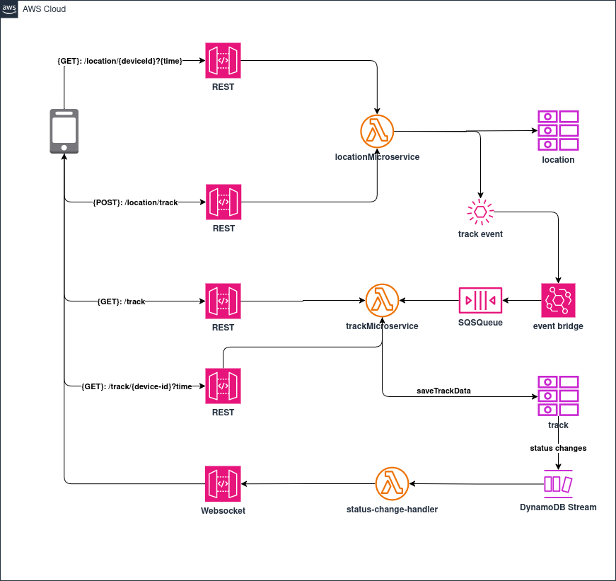
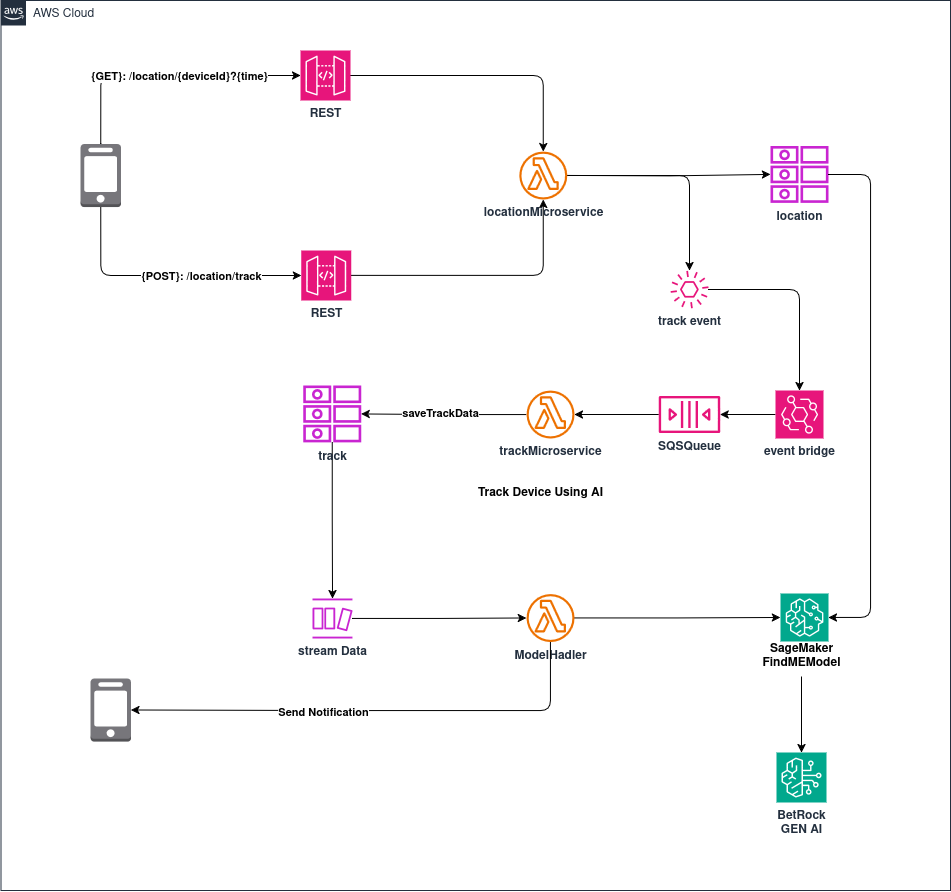

# Location Tracker Microservices Serverless
This project implements a scalable backend system for tracking IoT devices in real-time using AWS serverless architecture. The solution can connects mobile applications with IoT tracker devices, processes location data through AWS IoT Core, and provides real-time coordinates via a serverless microservice architecture.

## TABLE OF CONTENTS
1. [Features](#FEATURES) 
2. [Stack](#STACK)
3. [Architecture](#ARCHITECTURE)
4. [Setup](#SETUP)
5. [Deployment](#DEPLOYMENT)
6. [Demo](#DEMO)
8. [Test](#TEST)
9. [Author](#AUTHOR)


## FEATURES
    
- **Device Integration**: Seamless connection between IoT tracker devices and mobile applications (not implemented mobile development yet)
- **AWS IoT Core**: Device registration and MQTT communication (For real world products need certificates)
- **Serverless Processing**: Lambda functions for efficient data handling and processing
- **Real-time Updates**: Immediate location coordinate transmission to connected clients
- **Scalable Architecture**: Cloud-native design using AWS serverless components
- **Easy Deployment**: Minutes of Deployment using CDK 

## STACK

-  - Device management and secure MQTT communication  
-  - Serverless functions for real-time data processing  
-  - Persistent storage for device and location data  
-  - RESTful endpoints for mobile/web integration  
-  - Message routing and processing  
-  - Event-driven architecture  
-  - Decoupled message queuing  


## ARCHITECTURE
**Device Connection**
<br />
1. Device (Mobile App) Connects via WebSocket:

- Path: ```/device/connect```

- A client (e.g. mobile or web app) initiates a WebSocket connection.

-  The WebSocket gateway triggers the ```connectDevice``` Lambda function, which:


2. IoT Device Sends Coordinates:

- The Location Tracker (e.g. GPS-enabled IoT device) sends location data to AWS IoT Core.

- IoT Core matches incoming messages with Message Routing Rules, which trigger:


3. Client Receives Updates:

- The WebSocket client receives live location updates pushed from the backend.

4. For Testing purpose , you can use the following API to send fake location data:
- Path: ```/test/coordinates```

**Device Data**
<br />

1. Exposes CRUD APIs to manage registered devices.

2. REST API Gateway exposing 4 endpoints:

- ```POST /device``` – Registers a device (payload includes device info).

- ```GET /device``` – Retrieves all registered devices.

- ```GET /device/{deviceId}``` – Retrieves a single device’s data.

- ```DELETE /device/{deviceId}``` – Deletes a device.

3. All routes trigger the ```deviceMicroservice``` Lambda function 
4. Device records are stored in a DynamoDB ```device``` table.

**Location Track Data**
<br />

1. Handles tracking and location events, and supports event-driven processing via SQS & EventBridge.
2. Location Retrieval & Tracking APIs:
- ```GET /location/{deviceId}?time``` – Fetch historical location data from location table via ```locationMicroservice```.
- ```POST /location/track``` – Submits new location data to ```locationMicroservice```.

3. Track Events:
- ```locationMicroservice``` stores the location data in the ```location``` table.
- It then emits a track event, which is pushed to EventBridge.

4. Event-Driven Tracking:
- EventBridge routes the event to an SQS Queue.
- ```trackMicroservice``` Lambda is triggered via the queue.
- It processes the event and stores it in the ```track``` table for auditing or analytics.

5. Track Query APIs:
- ```GET /track``` – Fetch all track records.
- ```GET /track/{device-id}?time``` – Fetch specific track history for a device.

**Road Map Plan**
<br />
- AI-based device location prediction system using Amazon Bedrock (for generating contextual insights) and Amazon SageMaker (for prediction using a model, possibly with reinforcement learning later).

## SETUP

### AWS Cost Management & Good Practices
1. Use the AWS Free Tier Wisely: AWS gives you many services for free up to certain limits (some forever, some for 12 months). This is great for learning and building small apps without paying. Always check your usage to stay within these free limits using tools like the Cost Management Dashboard.

2. "Turn Off the Lights": If you're not using AWS resources (like servers or databases), shut them down or delete them. Just like turning off lights when you leave a room, this saves money. The AWS CDK helps a lot: cdk deploy builds your app, and cdk destroy easily removes everything, preventing unexpected costs.

3. Keep Your Account Secure: Never share your AWS account details or passwords. If someone else gets access, they could create expensive resources on your account without you knowing.

4. Minimize the use of your powerful AWS root account. Instead, create and use IAM users with specific, limited permissions for all your regular AWS activities to significantly enhance the security of your cloud environment.

### Prerequisites 
1. **[Need AWS Account with programatic access](https://docs.aws.amazon.com/keyspaces/latest/devguide/access.credentials.IAM.html)** 
2. **[AWS CLI Install](https://docs.aws.amazon.com/cli/latest/userguide/getting-started-install.html)**
3. **[AWS CLI Quick Setup](https://docs.aws.amazon.com/cli/latest/userguide/getting-started-quickstart.html)**
4. **[AWS CLI Configuration and credential file settings](https://docs.aws.amazon.com/cli/latest/userguide/cli-configure-files.html)**
5. **[Node.js](https://nodejs.org/en/)**<br /> 
**This is a crucial prerequisite for two reasons:**
- It's required for running AWS CDK (Cloud Development Kit) applications.
- Your AWS Lambda functions will be developed using Node.js.
6. **[AWS CDK Toolkit](https://docs.aws.amazon.com/cdk/v2/guide/home.html)**
- ```npm install -g aws-cdk```
7. **[Working with the AWS CDK in TypeScript](https://docs.aws.amazon.com/cdk/v2/guide/work-with-cdk-typescript.html)**
8. **[IDE (Visual Studio Code)](https://code.visualstudio.com/)**


## DEPLOYMENT

### The AWS CDK Workflow:
1. **Initialize Application:** Create a new CDK project using the ```cdk init``` command. This sets up a basic project template.

2. ***Add Code to Create Resources:** Write code within your application to define AWS resources (called Constructs) inside a Stack. For example, you might add code to create an SQS queue or an S3 bucket.

3. **Build Application (Optional):** While ```cdk``` commands often handle this automatically, you can manually build your application to catch syntax and type errors.

4. **Synthesize Stacks:** Run ```cdk synthesize``` to transform your CDK code into an AWS CloudFormation template. This step helps catch logical errors in your resource definitions.

5. Deploy Stacks: Use ```cdk deploy``` to provision the resources defined in your CloudFormation template onto your AWS account. This step might uncover permission issues if the CDK toolkit lacks necessary permissions.

### Key Best Practices & Lifecycle:
- The build step catches basic coding errors (syntax, types).
- The synthesize step identifies logical errors in your AWS resource definitions.
- The deploy step can reveal permission problems.
- The general lifecycle involves: **Code → Build → Synthesize → Deploy → Fix issues → Repeat**.

### Sample Project Creation & Structure
1. **Create a Project Directory:**
- Open your command window (e.g., Windows Terminal).
- Navigate to your desired location.
- Create a new directory named ```hello-cdk``` using the command: ```mkdir hello-cdk```.
- Important: Use this exact name (```hello-cdk```) as it aligns with an AWS CDK training project template.
- Change into the newly created directory: ```cd hello-cdk```.
2. **Initialize the CDK Application:**
- Inside the hello-cdk directory, run the CDK initialization command: ```cdk init app --language typescript```
- CDK will then execute npm install to set up necessary dependencies and create a structured project with various files and folders. 
3. **Open the Project in Visual Studio Code (VS Code):**
- From within the ```hello-cdk ```directory in your command window, type: ```code .``` and press Enter.
4. **Structured layout created by CDK:**
- ```bin``` **folder:** This typically contains the entry point for your CDK application.
- ```lib``` **folder:** This is where you'll define your infrastructure. Inside ```lib```, you'll find a TypeScript file (e.g., ```hello-cdk-stack.ts```) which defines your CDK Stack. This is where you'll write code to define AWS resources using TypeScript.
- ```node_modules``` **folder**: This contains all the NPM packages and dependencies installed during the ```cdk init``` process.
- ```cdk.json```: CDK-specific configuration.
- ```package.json```: Node.js project configuration, including scripts and dependencies.
- ```package-lock.json```: Locks the exact versions of dependencies used in your project.

### CDK Commands
- **```cdk verion```** Show the version
- **```cdk init```** Initializes a new CDK project.
- **```cdk list```** List the stack.
- **```cdk synth```** Synthesizes the CDK code into a CloudFormation template.
- **```cdk diff```** Compares the current state of your AWS resources with the state defined in your
- **```cdk bootstrap```** Initializes the AWS CDK toolkit in your AWS account.
- **```cdk deploy```** Deploys the synthesized CloudFormation template to AWS.
- **```cdk destroy```** Destroys the AWS resources created by the CDK.


## DEMO 


## TEST
You can test the APIs using the Postman collection:

[Download Postman Collection](postman/location-tracker.postman_collection.json)

## AUTHOR   
<br />
[Minoltan Issack](www.linkedin.com/in/minoltan)<br />
Senior Software Engineer<br />
B.Sc. (Hons) in Software Engineering<br />
University of Kelaniya